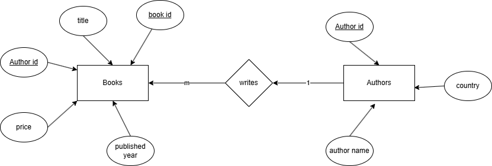
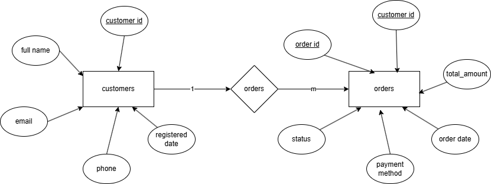

## DBMS LAB 2 EXERCISES
Siddharth Karmokar, 123cs0061
--- 

## Exercise 1:1: ER_DIAGRAM

---
<!-- 

 -->

## Excercise 1:2: AUTHORS

---

## Excercise 1:3: BOOKS

---

## Excercise 1:4: ADD AND DROP GENRE FROM BOOKS

---

## Excercise 1:5: INSERT 5 RECORDS INTO AUTHORS AND BOOKS

---

## Exercise 1:6: UPDATE PRICE OF ONE BOOK

---
<!-- 

 -->

## Exercise 1:7: MERGE COMMAND TO UPDATE ONE BOOK RECORD

---

## Exercise 2:1: ER_DIAGRAM

---
<!-- 

 -->

## Excercise 2:2: CUSTOMERS

---

## Excercise 2:3: ORDERS

---

## Excercise 2:4: ADD PAYMENT_METHOD TO ORDERS, MODIFY PERCISION OF TOTAL_AMOUNT, DROP STATUS

---

## Excercise 2:5: INSERT 5 CUSTOMERS AND LINKED ORDERS

---

## Exercise 2:6: UPDATE PAYMENT METHODS FOR ORDERS ABOVE A CERTAIN VALUE

---
<!-- 

 -->

## Exercise 2:7: DELETE ORDERS FROM YETERDAY

---

## Exercise 2:7: MERGE TO UPDATE CUSTOMER DATA

---
