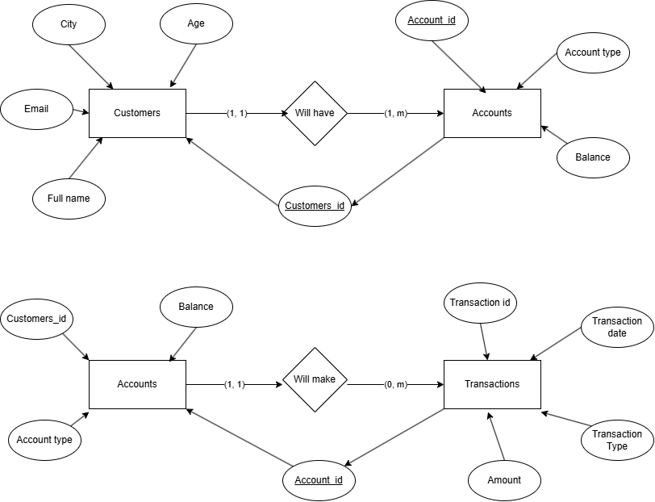
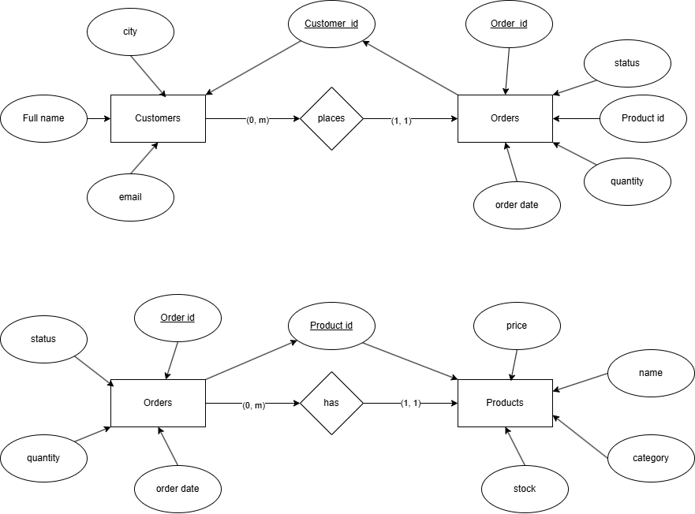

## DBMS LAB 3 EXERCISES
Siddharth Karmokar, 123cs0061
--- 

## Exercise 1:1: ER_DIAGRAM

---

## Excercise 1:2: Create Customers Table: 

## Excercise 1:3: Create Accounts Table: 

## Excercise 1:4: Create Transactions Table: 

---

## Excercise 1:5: Alter Customers Table

---

## Excercise 1:6: Insert into Customers, Accounts, and Transactions 

---

## Excercise 1:7: Update Balance in Accounts

## Excercise 1:8: Delete Transactions

---

## Exercise 1:9: Merge into Accounts Table

---

## Exercise 1:10: Queries
## Exercise 1:10:1 

## Exercise 1:10:2

## Exercise 1:10:3

## Exercise 1:10:4

## Exercise 1:10:5

## Exercise 1:10:6

---

## Exercise 2:1: ER Diagram

## 

  

## Exercise 2:2: Create PRODUCTS Table

## 

  

## Exercise 2:3: Create CUSTOMERS Table

## 

  

## Exercise 2:4: Create ORDERS Table

## 

  

## Exercise 2:5: Alter PRODUCTS Table (Add DISCOUNT, Drop CATEGORY)

  

## Exercise 2:6: Insert Data into PRODUCTS, CUSTOMERS, ORDERS

---------------------------------------------

  

## Exercise 2:7: Update Stock of One Product

## 

  

## Exercise 2:8: Delete Orders with Status = 'Cancelled'

## 

  

## Exercise 2:9: Use MERGE to Insert or Update Customer Record

## 

  

## Exercise 2:10: Queries

### Exercise 2:10:1

### Exercise 2:10:2

### Exercise 2:10:3

### Exercise 2:10:4

### Exercise 2:10:5

  
